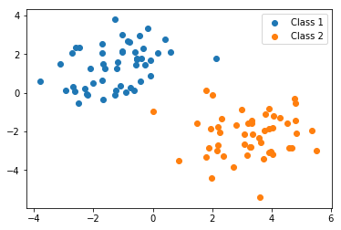

### ARX model

The ARX (autoregressive with exogenous inputs) model is useful for modelling a time series $y_t$ that evolves based on both its recent states $y_{t-1},...,y_{t-p}$ and an exogenous variable $x_t$. Examples include power demand influenced by ambient temperature, and stock prices influenced by the price of crude oil. An order-$p$ linear ARX model would be given by 

<center> $y_t = c + \phi_1 y_{t-1} + \cdots + \phi_p y_{t-p} + w x_t$ </center>

where $c, \{\phi_k\}_{k=1}^p,$ and $w$ are constants.

Fitting an ARX model is very similar to fitting an AR (autoregressive) model, except now we have more information at our disposal. Specifically, $x_t$ is treated as another feature along with $y_{t-1},...,y_{t-p}$ and the bias feature (constant 1, with coefficient $c$) when predicting $y_t$. 

### Practical Classification: Logistic Regression

Classification is an important task in data science: given some unlabeled observations/data, we want to group the observations based on common features. Two common classification algorithms are logistic regression and support vector machines (SVMs), but there are _many_ algorithms to [choose from](https://scikit-learn.org/stable/auto_examples/classification/plot_classifier_comparison.html#sphx-glr-auto-examples-classification-plot-classifier-comparison-py). In this homework we'll focus on logistic regression and walk through some practical examples of binary classification: where data can either be one of two classes, which we label 0 or 1. Ultimately, classifiers like logistic regression and SVM, which we'll talk about in the next assignment, _try to find a line that seperates the input data on one of two sides_.

Fig. 1 illustrates the primary intuition behind a classifier. Each point represents data from some measurements. The blue class and the orange class each represent something about that data: for example, the measurements were from people testing positive or negative for a virus. A classifier finds a line that seperates the data according to the training data we use, which is very nicely seperated in this example (it almost never is in reality). SVM and Logistic regression come up with slightly different decisions boundaries, illustrated in the figure. We'll talk about the differences in the next assignment.

Fig. 1: SVM (dashed) and Logistic Regression (solid) decision boundaries


The logistic loss function is derived from the [logistic function](https://en.wikipedia.org/wiki/Logistic_function). What's important to notice is that the output switches between 0 and 1---gradually---based on the input value. This is a critical ingredient for neural networks which we'll get to make use of in future assignments and partly why it's called a _neural_ network. Biological neurons switch from outputing [no signal to outputting a full signal](https://en.wikipedia.org/wiki/All-or-none_law) once they've recieved a sufficient signal from input neurons, with some noisy-ness due in part to the chemical process that governs the input and output interactions. The probability that a neuron will fire looks a lot like a logistic function.

Fig. 2: Outputing 0 or 1


```python
import numpy as np
import matplotlib.pyplot as plt
import sklearn.metrics
from sklearn.svm import SVC
from sklearn.linear_model import LogisticRegression
```

We've seen in previous assignments how to use sklearn's built in data analysis tools. Using these classification algorithms is very similar, so I won't be providing example code. I've imported the appropriate libraries above. Read the manpage for [Logistic Regression](https://scikit-learn.org/stable/modules/generated/sklearn.linear_model.LogisticRegression.html) and before starting the assignment to see example usage and what each input value is for. Just like the previous assignments we declare a model object, then use the .fit() method.

You will also need to compute the precision and recall of your classifiers. Refer to this really good [Wikipedia article](https://en.wikipedia.org/wiki/Precision_and_recall) on the difference. Either write your own functions, or use sklearn's built-in [precision](https://scikit-learn.org/stable/modules/generated/sklearn.metrics.precision_score.html#sklearn.metrics.precision_score) and [recall](https://scikit-learn.org/stable/modules/generated/sklearn.metrics.recall_score.html#sklearn.metrics.recall_score) functions in the sklearn.metrics library I've imported for you above.


```python
#data for assignment
training_data = np.loadtxt("homework_5_train.txt")
X_train = training_data[:,0:2] #selects columns 1 and 2, which are the x and y coords of the data
Y_train = training_data[:,2] #selections column 3, which is the 0 or 1 label of the data

test_data = np.loadtxt("homework_5_test.txt")
X_test = test_data[:,0:2]
Y_test = test_data[:,2]
```


```python
#plotting each class seperately, not important for training the models
X_1 = []
X_2 = []
for row in range(X_train.shape[0]):
    if Y_train[row] == 0:
        X_1.append(X_train[row,:])
    else:
        X_2.append(X_train[row,:])
X_1 = np.asarray(X_1)
X_2 = np.asarray(X_2)

plt.scatter(X_1[:,0], X_1[:,1], label="Class 1")
plt.scatter(X_2[:,0], X_2[:,1], label="Class 2")
plt.legend()
plt.show()
```





### Problem 1

Use logistic regression on the training data set X_train and Y_train, train a classifier. Compute and print the training precision and recall.


```python
#insert your code here

logreg_model_obj = LogisticRegression()
```

### Problem 2

Using the classifier trained in problem 1, compute the precision and recall of the model on the testing data set X_test and Y_test.


```python
#insert your code here
```

### Problem 3

You are given two time series, X and Y. Fit y(t) using a second-order linear ARX model with exogenous input x(t). Print the coefficients c, phi1, phi2, and w. 

```python
#insert your code here
```